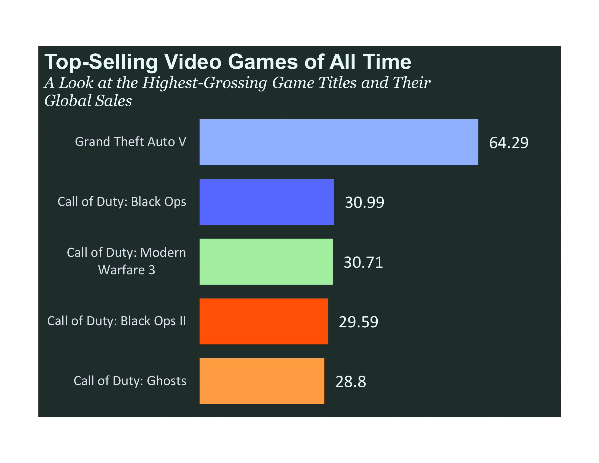

# Video Game Sales Analysis 📊🎮 

## Overview  
This project analyzes global video game sales trends from 1977 to 2024 using **Excel** for ETL, visualization, and insights.  

## Data Processing  
- **Data Cleaning & Transformation:** Handled missing values, standardized formats.  
- **Sales Trend Analysis:** Identified key growth periods and downturns.  
- **Regional Performance:** Visualized sales distribution across North America, Europe & Africa, Japan, and other regions.  

## Key Findings  
- 🎮 **Best-Selling Games:** The top games generated massive global revenue.  
- 🌍 **Regional Market Share:** North America leads with 47.5%, followed by Europe (27.2%).  
- 📈 **Sales Trend:** The industry peaked in **2008** due to Online Gaming & Blockbuster Franchises (2000–2010) with the global gaming industry hit **$4.3B in 2008**, driven by casual gaming, sports games, and FPS shooters.  

## Visuals  
Below are key insights from the dashboard:  

  

## Tools Used  
✅ **Microsoft Excel** - Data cleaning, visualization, and analysis  

## Author  
[Ridwan D. Okeshola] – [LinkedIn Profile](https://www.linkedin.com/in/ridwanokeshola)  
**Link to Dashboard File:** [Gaming Sales Dashboard](https://drive.google.com/file/d/1LmPwQzW4QbtUoM1zlzO6TJZkyPMVZVe1/view?usp=sharing)
## Contact  
Feel free to reach out for collaborations or questions! 🚀  
